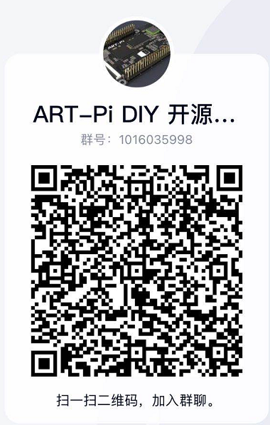

## Introduction

[中文页](README_ZH.md) | English Page

The **sdk-bsp-stm32h7r-realthread-artpi2** is a support package developed by the RT-Thread team for the ART-Pi development board. It also serves as a software SDK for users to develop their applications more easily and conveniently.

The **ART-Pi2** is an open-source hardware platform designed by the RT-Thread team specifically for embedded software engineers and open-source makers, offering extensive expandability for DIY projects.


## Directory Structure

```
$ sdk-bsp-stm32h7r-realthread-artpi2
├── README.md
├── RealThread_STM32H7R-ART-Pi2.yaml
├── debug
├── documents
│ ├── coding_style_cn.md
│ ├── RT-Thread Programming Guide.pdf
│ ├── board
│ └── figures
├── libraries
│ ├── STM32H7RSxx_HAL_Driver
│ ├── drivers
│ └── touchgfx_lib
├── projects
│ ├── art_pi_blink_led
│ ├── art_pi_bootloader
│ ├── art_pi2_lvgl_demo
│ ├── art_pi2_touchgfx
│ ├── art_pi2_sdcard
│ └── art_pi_wifi
├── rt-thread
└── tools
```

- **RealThread_STMH7R-ART-Pi.yaml**: Describes the hardware information of ART-Pi.
- **documents**: Contains schematics, documents, images, and datasheets.
- **libraries**: Includes STM32H7 firmware libraries, general peripheral drivers, and TouchGFX libraries.
- **projects**: Example project folders, including factory programs, gateway programs, etc.
- **rt-thread**: RT-Thread source code.
- **tools**: Contains Wi-Fi firmware, MDK download algorithms, etc.

## Usage

The **sdk-bsp-stm32h7r-realthread-artpi** supports development with RT-Thread Studio and MDK.

### Development with RT-Thread Studio

1. Open the RT-Thread Studio package manager and install the ART-Pi SDK resource package.

    

2. After installation, select "Create Project Based on BSP."

    

### Development with MDK

To avoid the SDK becoming bloated due to continuous updates, the `rt-thread` and `libraries` folders are extracted separately. This may cause compilation errors in MDK projects due to missing files. Here are two methods to resolve this issue:

**Method 1:**

1. Double-click the `mklinks.bat` file in the `project` directory, such as the one in `sdk-bsp-stm32h7r-realthread-artpi2\projects\art_pi2_blink_led`.

2. Check if the `rt-thread` and `libraries` folders appear in the `sdk-bsp-stm32h7r-realthread-artpi2\projects\art_pi2_blink_led` directory.

3. Use the [ENV-2.0](https://club.rt-thread.org/ask/article/af8952fcf0ca464b.html) tool to execute `scons --target=mdk5` to update the MDK5 project files.

**Method 2:**

1. Download the SDK from the [ART-Pi SDK Repository](https://github.com/RT-Thread-Studio/sdk-bsp-stm32h7r-realthread-artpi2).
2. Navigate to the project directory, e.g., `sdk-bsp-stm32h7r-realthread-artpi2\projects\art_pi2_blink_led`.
3. Use the [ENV-2.0](https://club.rt-thread.org/ask/article/af8952fcf0ca464b.html) tool to execute the `mklink` command to create symbolic links for the `rt-thread` and `libraries` folders.

```
E:\project\sdk-bsp-stm32h7r-realthread-artpi2\projects\art_pi2_blink_led>mklink /D rt-thread ....\rt-thread
  symbolic link created for rt-thread <<===>> ....\rt-thread

E:\project\sdk-bsp-stm32h7r-realthread-artpi2\projects>mklink /D libraries ....\libraries
symbolic link created for libraries <<===>> ....\libraries

E:\project\sdk-bsp-stm32h7r-realthread-artpi2\projects>
```

4. Use the [ENV-2.0](https://club.rt-thread.org/ask/article/af8952fcf0ca464b.html) tool to execute `scons --target=mdk5` to update the MDK5 project files.

## ART-Pi Communication Platform

ART-Pi is an open-source creative hardware platform. We look forward to more enthusiasts discovering its potential. If you have any ideas or suggestions while using it, please contact us through the following channels:

- RT-Thread [Community Forum](https://club.rt-thread.org).
- ART-Pi Official QQ Group (1016035998).



## Contributing Code

If you are interested in ART-Pi and have some exciting projects to share, we welcome your contributions. Please refer to the [ART-Pi Code Contribution Guide](https://github.com/RT-Thread-Studio/sdk-bsp-stm32h7r-realthread-artpi/blob/master/documents/UM5004-RT-Thread%20ART-Pi%20%E4%BB%A3%E7%A0%81%E8%B4%A1%E7%8C%AE%E6%89%8B%E5%86%8C.md).

## Participating in Projects

Here are some ways you can contribute:
- Maintain existing SDK repository code.
- Submit project code to be merged into the SDK repository.
- Submit showcase projects (code may not be merged into the SDK repository but can be open-sourced elsewhere).
- Submit expansion boards.
- Write articles or tutorials.
